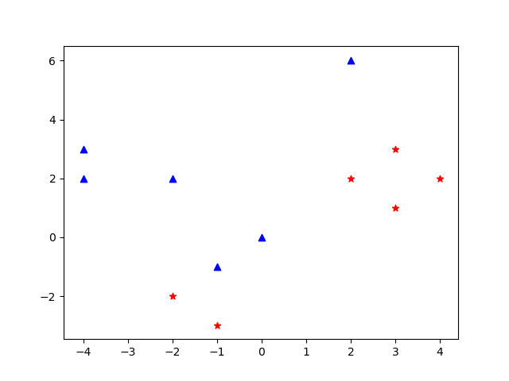
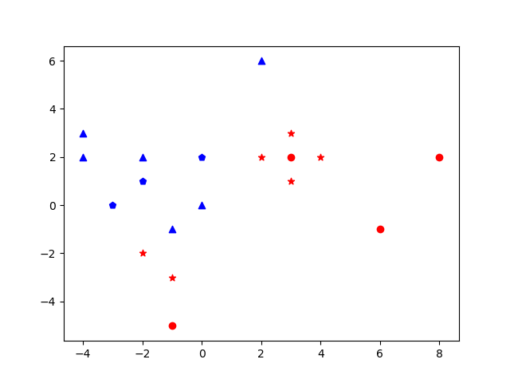
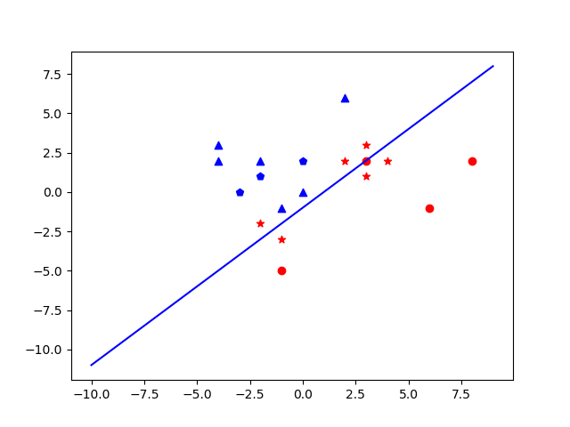

<h3>Designing a minimum distance to class mean classifier:</h3>
<figure>
  
  <figcaption>Fig. - Demo Pic1.</figcaption>
</figure> 
<figure>
  
  <figcaption>Fig. - Demo Pic2.</figcaption>
</figure> 
<figure>
  
  <figcaption>Fig. - Demo Pic3.</figcaption>
</figure> 