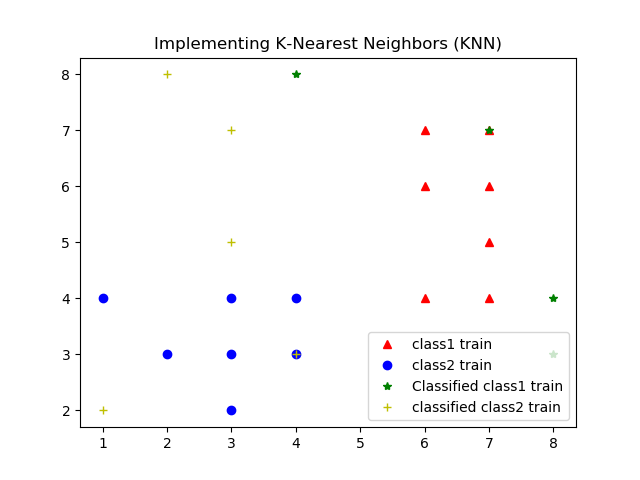
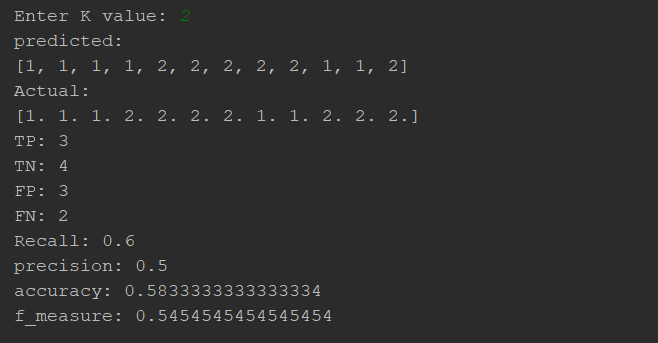

<h3>Implementing K-Nearest Neighbors (KNN):</h3>

<h5>Type1:</h5>
<figure>
  
  <figcaption>Fig. - Demo Pic1.</figcaption>
</figure> 

<h5>Type2:</h5>
<figure>
  
  <figcaption>Fig. - Demo Pic1.</figcaption>
</figure> 

<figure>
  
  <figcaption>Fig. - Demo Pic2.</figcaption>
</figure> 

